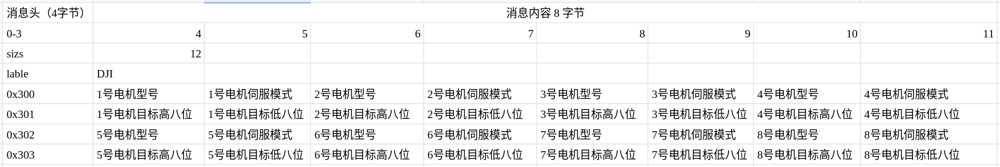

# WTR_canbus

> Author: Yunfan REB
>
> Email: renyunfan@outlook.com

### History:

| Data       | Version | Notes |
| ---------- | ------- | ----- |
| 2020.07.03 | V1.0    |       |
|            |         |       |
|            |         |       |

# 1 安装依赖

进入googleLOG文件夹，分别在glog等三个文件夹的根目录执行以下命令安装库：

```bash
mkdir build
cd build 
cmake ..
make 
sudo make install
```

注意，三个库都需要在各自根目录执行以上命令进行安装和编译。

# 2 使用方法

## 2.1 绑定USB

解决USB的永恒绑定授权

https://www.jb51.net/os/Ubuntu/392419.html

```
lsusb -vvv
```

找出USB设备的vendorID和productID

```
$ sudo vi /etc/udev/rules.d/50-myusb.rules
SUBSYSTEMS=="usb", ATTRS{idVendor}=="067b", ATTRS{idProduct}=="2303", GROUP="users", MODE="0666"
```

其中067b和2303替换成vendorID和productID，users改成自己的用户名。

重启并重新加载udev规则：

```bash
sudo udevadm control --reload
sudo ls -all /dev/bus/usb/001
```

注意：未绑定USB可能导致报错` No device connected!`

## 2.2

将`wtr_usb2ros` 拷贝到你的工作空间，编译运行即可

```bash
catkin_make
source devel/setup.bash
rosrun wtr_usb2ros main
```

# 3 通讯格式

## 3.1电机通讯格式

最新版本见

> 【腾讯文档】USB2ROS通讯手册
> https://docs.qq.com/sheet/DSlNFUEtxRWhxTkFR?tab=BB08J2




发布者例程如下

```cpp
//
// Created by kevin on 2020/5/31.
//

#include <ros/ros.h>
#include <std_msgs/UInt8MultiArray.h>

#define M3508 0x00
#define M2006 0x01
#define M6020 0x02

#define UNDEFINED 0x00
#define SPEED 0x01
#define POSITION 0x02

using namespace std;

typedef union{
    short data_s;
    uint8_t data_i[2];
}SHORT_T;

int main(int argc, char **argv)
{
    ros::init(argc, argv, "controller");
    ros::NodeHandle nh;
    ros::Publisher Bus_Publisher;
    Bus_Publisher = nh.advertise<std_msgs::UInt8MultiArray>("/wtr/canbus",1,true);
    int8_t speed = -1;
    while(!ros::isShuttingDown()) {
        std_msgs::UInt8MultiArray pub_msg;
        const uint32_t dataSize = 12 ;
        pub_msg.layout.dim.push_back(std_msgs::MultiArrayDimension());
        pub_msg.layout.dim[0].size = dataSize;
        pub_msg.layout.dim[0].label = "DJI";
        pub_msg.data.resize(dataSize);
        int32_t can_id = 0x0300;
        // 消息ID 4字节
        pub_msg.data[0]=((uint8_t)(can_id>>24));
        pub_msg.data[1]=((uint8_t)(can_id>>16));
        pub_msg.data[2]=((uint8_t)(can_id>>8));
        pub_msg.data[3]=((uint8_t)(can_id));
        // 消息内容 8字节
        pub_msg.data[4]=(M2006);
        pub_msg.data[5]=(SPEED);
        pub_msg.data[6]=(M3508);
        pub_msg.data[7]=(UNDEFINED);
        pub_msg.data[8]=(M2006);
        pub_msg.data[9]=(UNDEFINED);
        pub_msg.data[10]=(M6020);
        pub_msg.data[11]=(UNDEFINED);
        Bus_Publisher.publish(pub);
//        sleep(1);
    }

    return 0;
}

```

## 3.2gpio通讯格式

```cpp
int main(int argc, char **argv)
{
    ros::init(argc, argv, "controller");
    ros::NodeHandle nh;
    ros::Publisher pub_ctrl,pub_gpio;
    
    pub_gpio = nh.advertise<std_msgs::UInt8MultiArray>("/gpio",1,true);
    

    while(!ros::isShuttingDown()) {

        std_msgs::UInt8MultiArray pub_1,pub_2;
        
        int32_t gpio_id1 = 0x500;
        int32_t gpio_id2 = 0x501;
        pub_1.data.push_back((uint8_t)(gpio_id1>>24));
        pub_1.data.push_back((uint8_t)(gpio_id1>>16));
        pub_1.data.push_back((uint8_t)(gpio_id1>>8));
        pub_1.data.push_back((uint8_t)(gpio_id1));

        pub_1.data.push_back(0x1);
        pub_1.data.push_back(0x1);
        pub_1.data.push_back(0x1);
        pub_1.data.push_back(0x1);
        pub_1.data.push_back(0x1);
        pub_1.data.push_back(0x1);
        pub_1.data.push_back(0x1);
        pub_1.data.push_back(0x1);
        pub_gpio.publish(pub_1);

        pub_2.data.push_back((uint8_t)(gpio_id2>>24));
        pub_2.data.push_back((uint8_t)(gpio_id2>>16));
        pub_2.data.push_back((uint8_t)(gpio_id2>>8));
        pub_2.data.push_back((uint8_t)(gpio_id2));

        pub_2.data.push_back(0x1);
        pub_2.data.push_back(0x1);
        pub_2.data.push_back(0x1);
        pub_2.data.push_back(0x1);
        pub_2.data.push_back(0x1);
        pub_2.data.push_back(0x1);
        pub_2.data.push_back(0x1);
        pub_2.data.push_back(0x1);
        pub_gpio.publish(pub_2);
    }
    return 0;
}
```


# 4 反馈节点

## 4.1 反馈电机状态：

编译成功后`source`即可查看电机数据结构

话题根据电机编号，分别为

```cpp
/wtr/canbus/DJI/x	// x为电机的编号
```

```msg
[wtr_usb2ros/motor_msgs]:
std_msgs/Header header
  uint32 seq
  time stamp
  string frame_id
uint8 mode
uint16 ID
float32 angle
float32 current
float32 temperature
float32 speed
```

## 4.2 电机角度反馈汇总

电机角度反馈汇总为`Float32MultiArray`类型，话题为`/wtr/canbus/DJI/angles`